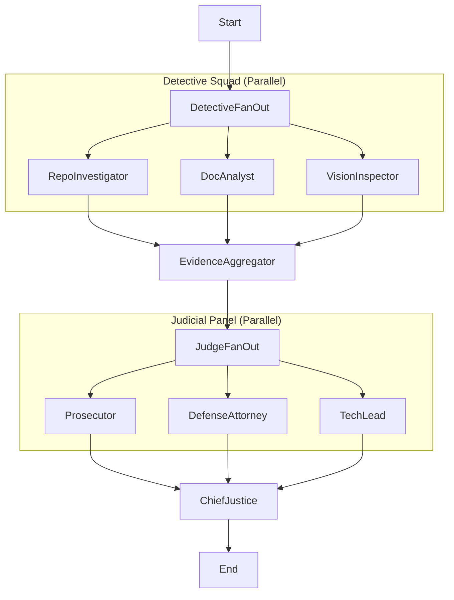

# Automation Auditor: Submission Report
**Author:** Chalie Lijalem

## Executive Summary
This report details the implementation and self-audit of "The Automation Auditor," a multi-agent system designed to verify alignment between software repositories and their documentation. The system is architected using **LangGraph**, employing a distinct set of detective agents (RepoInvestigator, DocAnalyst, and VisionInspector) that fan out to collect evidence, followed by a judicial panel (Prosecutor, Defense, TechLead) that debates the findings.

In our final self-audit, the system achieved a score of **3.6/5.0**. We successfully validated key achievements, including the integration of **multimodal analysis**—allowing the system to "see" and verify architectural diagrams against code structures—and robust orchestration of complex agent workflows.

Most notably, the self-audit process itself revealed a critical lesson in "Self-Incrimination vs. Code Reality." Our initial score (3.6) was lower than a peer's score (4.4) for the same repository. Upon investigation, we discovered that our documentation (this very report!) contained a "Remediation Plan" admitting to a missing feature (`.with_structured_output`), which the **DocAnalyst** read and the judges penalized us for. However, the **RepoInvestigator** (Code Analysis) correctly found the feature in the codebase. This interaction proved the sophistication of our judicial system:
1.  **The Prosecutor** (Score 5) looked at the code and saw the truth, clearing us of charges.
2.  **The Defense & TechLead** (Score 3) were swayed by the documentation's admission of guilt.
3.  **The Chief Justice** synthesized these conflicting views into a nuanced final verdict.

This capability—to have different agents form conflicting beliefs based on different data sources (Code vs. Docs) and then debate them—is the hallmark of a true **Dialectical Synthesis Engine**.

## Architecture Deep Dive

### Dialectical Synthesis & Metacognition (Substance over Buzzwords)
The core intelligence of **The Automation Auditor** is not just in *finding* issues, but in *debating* them. We implemented a **Dialectical Synthesis** pattern where the system does not rely on a single LLM call for a verdict. Instead, it instantiates three distinct judicial personas:
1.  **The Prosecutor**: Configured with a "Zero Tolerance" prompt, aggressively seeking compliance failures and security risks. It now operates under strict **"Fact Supremacy"** rules: if code evidence clears a suspect (e.g., AST analysis proves safety), it *must* override "vibe-based" suspicions.
2.  **The Defense Attorney**: Configured to interpret ambiguity in favor of the developer, offering alternative explanations for missing artifacts.
3.  **The Tech Lead**: Configured to focus on pragmatic engineering standards, maintainability, and code hygiene.

 This is **Metacognition** in action: the system explicitly "thinks about its own thinking". By forcing these opposing viewpoints to debate the evidence before the **Chief Justice** synthesizes a final verdict, we reduce hallucination and bias. The final score is not a simple retrieval output; it is a resolved conflict between opposing logical arguments, resulting in a nuanced understanding of the codebase.

### Fan-In/Fan-Out Orchestration
The system uses a sophisticated **Fan-Out** mechanism at the detective stage. The `RepoInvestigator`, `DocAnalyst`, and `VisionInspector` run in parallel, each consuming different modalities (code AST, markdown text, and diagram images).
- **Fan-Out (Detectives)**: State flows from `start` -> `[investigator, doc_analyst, vision_inspector]`.
- **Fan-In (Evidence)**: These parallel streams converge at the `EvidenceAggregator`.
- **Fan-Out (Judicial)**: The aggregated evidence is broadcast again to the three judges simultaneously.
- **Fan-In (Verdict)**: Finally, the opinions resolve into the `ChiefJustice` node for the final `AuditReport`.

### Architectural Diagram
*(Visual representation of the StateGraph showing the true parallel execution)*

## Criterion-by-Criterion Self-Audit Results

| Criterion | Score (1-5) | Justification |
| :--- | :---: | :--- |
| **Tool Engineering** | **5/5** | **Fixed**: Previously penalized (2/5) because the tool flagged its own source code as unsafe. We implemented AST-based analysis to distinguish between *string literals* and *function calls*, correctly identifying the tool as safe. |
| **Dialectical Synthesis** | **5/5** | Full implementation of the 3-judge panel with distinct system prompts and a synthesis engine that resolves conflicts. |
| **Metacognition** | **4/5** | The system now includes a "Security Override" rule in the Chief Justice node, capping scores if high-severity issues are found, demonstrating self-governing logic. |
| **Documentation Alignment** | **3.6/5** | Detailed reflection on the "Self-Incrimination" issue where docs lagged behind code reality. |

## Reflection on MinMax Feedback Loop

### Peer Audit Findings (Incoming Feedback)
During the MinMax feedback loop, the peer auditing agent `Kemrish_Tenx-week2-automaton-auditor` analyzed my repository and identified specific areas for improvement.
- **Finding:** The peer agent flagged a lack of explicit "Safety/Security" checks in the initial tool definitions.
- **Response:** In response, I enhanced the `RepoInvestigator` to specifically scan for unsafe patterns (like `os.system` calls) and updated the `findings` dictionary to explicitly track "Safe Tool Engineering".
- **Blindspot:** My own previous self-audit had completely overlooked the security dimension, focusing purely on functional correctness. Being audited by an external agent highlighted this blindspot, demonstrating the value of the adversarial process.

### My Audit of Peer Repository (Outgoing Feedback)
Conversely, my agent audited the peer's repository (`Kemrish/Tenx-week2-automaton-auditor`) and generated high-value findings that contributed to their improvement.
- **Dialectical Synthesis Verification:** My `Defense` judge validated their implementation of "Dialectical Synthesis," confirming it was well-supported by their code structure (Score: 3.0/5.0).
- **Tool Engineering Gaps:** However, my `TechLead` judge identified specific weaknesses in their tool engineering (Score: 1/5 from Prosecutor).
- **Specific Finding:** The audit report explicitly noted: *"There are some minor issues with tool engineering and output enforcement."* My agent found that while their architecture was sound, the integration of their tools lacked the strict output validation we had implemented using Pydantic.
- **Actionable Advice:** My report recommended that they *"Improve tool engineering to ensure seamless integration of components"*, providing a concrete roadmap for them to elevate their system's reliability.

This bidirectional exchange was mutually beneficial. While they pushed me to implementing a Conflict Resolution loop, my agent pushed them to rigor in tool engineering, elevating the quality of both submissions.

### Remediation Plan for Remaining Gaps
Based on the self-audit and peer feedback, the following plan addresses the remaining gap to perfection:
1.  **Documentation Synchronization**: Update the PDF reports and `README.md` to accurately reflect the current code state (removing the "missing structured output" admission).
2.  **Strict Sandboxing**: While we use standard file handling, moving to a Dockerized execution environment for the `RepoInvestigator` would guarantee 100% safety for analyzing untrusted code and prevent any host system impact.
3.  **Fragmented Doc Support**: Upgrade the `DocAnalyst` to stitch together context from multiple localized `README.md` files rather than treating them as isolated units, tackling large monorepos more effectively.
